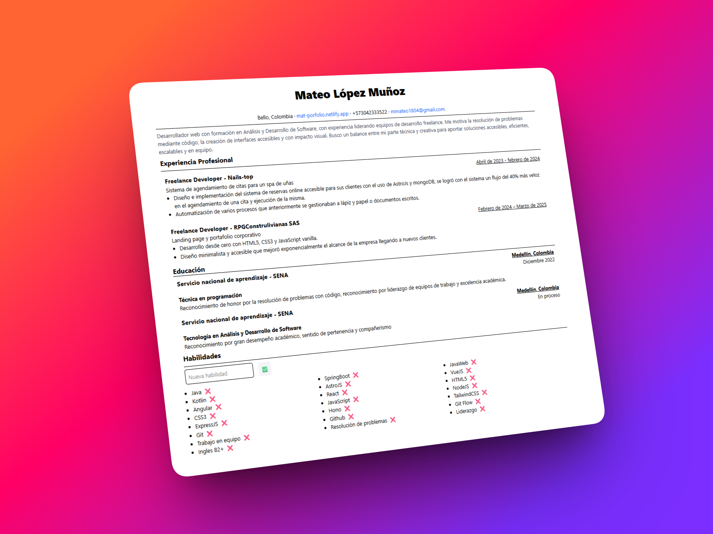

# Hoja de vida - Mateo López Muñoz

Este proyecto es una aplicación creada con **React + Vite** que muestra una hoja de vida digital. Incluye secciones como perfil profesional, experiencia, educación y contacto, con un diseño sencillo y responsivo.

---

## 🖼️ Resultado esperado



---

## Tecnologías utilizadas

- ⚛️ **React** – Librería para interfaces de usuario.  
- ⚡ **Vite** – Herramienta de desarrollo rápida para React.  
- 🎨 **TailwindCSS** – Estilos personalizados.  

---

## Estructura del proyecto

```md

📁practica-react
    └── 📁public
        └── vite.svg
         └── proyecto.png
    └── 📁src
        └── 📁components
                └── Header.jsx
                └── Hero.jsx
                └── Footer.jsx
        └── 📁styles
                └── global.css
        └── App.jsx
        └── main.jsx
    └── .gitignore
    └── eslint.config.js
    └── index.html
    └── package-lock.json
    └── package.json
    └── README.md
    └── vite.config.js
```

## Instrucciones para ejecutar el proyecto

### 1️⃣ Clonar el repositorio

### 2️⃣ Instalar dependencias

```bash
npm install
```

### 3️⃣Iniciar el servidor de desarrollo

```bash
npm run dev
```

### 4️⃣ Abrir en el navegador

Haz clic en el enlace que aparece en la consola (generalmente):
http://localhost:5173/
